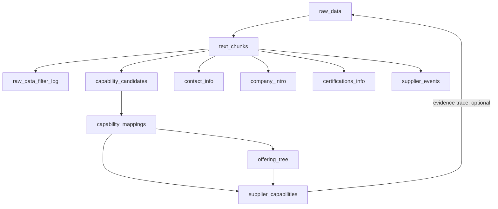
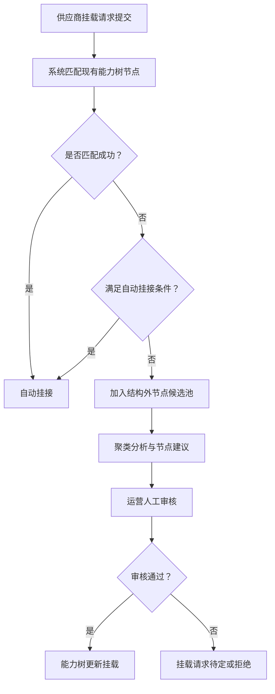

# 📄 原始数据处理与能力提取 Pipeline 表结构与数据流程设计(proposal)

## 能力结构设计指引原则

未来的自动聚类与分类过程将**不抛弃现有的** **offering_tree** **能力结构**，而是以此为基础进行延伸。

- 所有能力候选片段的归类与推荐，**应优先尝试挂接到当前能力树中**。
- 对于不能挂接的片段，可考虑聚类形成“结构外节点候选池”，供运营人工审核与能力树扩展使用。
- 此机制有利于保持语义一致性，避免结构割裂，有利于推荐、搜索和 Agent 推理。

---

## 1. `raw_data`

| 字段名       | 类型       | 说明                                     |
|--------------|------------|------------------------------------------|
| id           | PK         | 主键                                     |
| supplier_id  | FK         | 供应商ID                                 |
| source_type  | varchar    | 原始来源类型（如 web, pdf, manual_upload） |
| content      | text       | 原始提取后的全文（纯文本）                |
| parsed_at    | datetime   | 提取时间                                 |
| processed    | boolean    | 是否已处理                               |
| batch_id     | varchar    | 批处理编号，用于增量识别                 |

**数据流说明**：
- 来源：爬虫、上传系统、集成系统等
- 去向：作为能力切片与其他结构化提取的输入

## 2. `text_chunks`

存储原始语义片段，负责做“**启发式规则粗筛**”并标记 chunk_type，但不负责做 embedding，也不负责能力匹配。是所有结构化信息提取的源，包括后续的 contact_info、certification_info 等。

| 字段名                 | 类型     | 说明                                                         |
| ---------------------- | -------- | ------------------------------------------------------------ |
| id                     | PK       | 主键                                                         |
| raw_data_id            | FK       | 关联的原始数据ID                                             |
| chunk_index            | int      | 当前原文中位置索引(optional)                                 |
| text                   | text     | 文本片段                                                     |
| cleaned_text           | text     | 去噪后的文本片段                                             |
| chunk_type             | varchar  | 类型，如 （可以是 `general`、`capability_candidate`、`contact_info`、`company_intro`、`certifications_info`、`others` 等枚举类型） |
| embedding_processed_at | datetime | 该片段embedding处理完成时间（用于增量）                      |
| is_noise               | boolean  | 此片段为噪音                                                 |

**数据流说明**：

- 来源：`raw_data.content` 拆分器
- 去向：能力挂载、聚类、搜索等

为了控制系统的成本和提升效率，设计上采取以下措施：

- **过滤无用片段**：利用 `text_chunks.cleaned_text` 及启发式规则和轻量模型，排除明确的垃圾信息（如联系方式、版权页脚、过短无意义文本等），避免无效数据进入后续流程。
- **结构化与非结构化信息分离**：将当前明确需要或能够结构化管理的片段，如 `capability_candidates`、`contact_info`、`company_intro`、`certification_info` 等，单独处理和存储。
- **Others 分类归档**：将除以上结构化信息和明确垃圾信息之外的剩余文本，统一归类为“others”，作为非结构化数据做 embedding 存储和匹配，支持后续基于上下文的 Agent 推理。
- **动态扩展**：未来若发现某类“others”中的信息频繁出现且结构明确，可派生出新的结构化表进行专门管理。

这样既保证了数据处理的资源利用率，又为后续扩展留足了空间。

**字段说明补充**：

- `cleaned_text`：清洗后的文本，移除 HTML、特殊符号、模板重复、乱码、低质量广告等非自然语言片段，保留用于嵌入与分类的主要信息部分。

- `chunk_type`：对当前片段的用途或语义角色分类。主要包含以下几类：

  - `general`：默认值，尚未分类的常规片段；
  
  - `capability_candidate`：初步识别为可能含有能力表达的内容，将用于能力提取. **通过模型判断该片段可能包含能力表达而标记**，通常使用 `cleaned_text` 的 embedding 与训练模型比较，判断其与已知能力片段的相似性；
  
    得分超过某一阈值，则标为该类型；
  
    模型可使用聚类中心距离、分类器置信度等方式判断。
  
  - `garbage`：经规则或模型判断为噪声、无用信息、不具结构挂接价值。**注意：产品或服务描述、公司介绍等内容不应误标为 `garbage`，这些在其他下游任务中可能具有重要用途**；
  
  - `contact_info`、`company_intro`、`certification_info` 等可作为可选子类型，供后续多用途处理。

## 3. `capability_candidates`

**作用**：保存经初步规则与轻量模型判断为“可能是能力表达”的片段，用于后续做 embedding、能力预测、能力挂接等任务。**这是能力抽取流程中的初筛层，目的是节省算力与提升质量。**

### 字段设计：

| 字段名                 | 类型                  | 描述                                                         |
| ---------------------- | --------------------- | ------------------------------------------------------------ |
| `id`                   | PK                    | 主键                                                         |
| `chunk_id`             | FK (`text_chunks.id`) | 来源的文本片段                                               |
| `filtered_by`          | enum                  | 初筛方式：`rule`, `model`, `hybrid`                          |
| `filter_score`         | float (0-1)           | 若为模型筛选，记录其概率或置信度                             |
| `reason`               | text                  | 被保留的理由，可用于 debug，例如“命中关键词：主营/产品”或“模型评分 0.91” |
| `embedding_done`       | boolean               | 是否已完成 embedding（延迟执行）                             |
| `embedding`            | vector                | 可选，若已执行则保留结果                                     |
| `predicted_categories` | jsonb                 | 能力预测结果（如有）                                         |
| embedding_version      | text                  | 模型版本号，方便后续模型升级与对比                           |
| created_at             | timestamp             | timestamp                                                    |
| last_updated_at        | timestamp             | timestamp                                                    |

### 数据流说明：

- **来源**：
  - 来自 `text_chunks`，通过启发式规则、二分类模型或两者组合筛选；
- **目的**：
  - 减少后续 embedding 与分类的无效消耗；
  - 只保留“看起来可能有能力表达”的片段；
- **去向**：
  - 对该表记录执行 embedding；
  - embedding + 能力分类后，由人工或程序决定是否正式归档为 `capability_mappings`；
- **说明**：
  - **不包含最终挂接信息**；
  - 一个 chunk 是否进入该表，与是否最终挂接无关；
  - 可以作为后续自动标注模型训练数据的正样本来源池；

------

## 4. `capability_mappings`

**作用**：记录某个片段（text chunk）被判定或确认属于某个能力节点的映射关系，可由模型预测或人工归档产生，作为能力结构化数据的核心桥梁。

### 字段设计：

| 字段名             | 类型                    | 描述                                                         |
| ------------------ | ----------------------- | ------------------------------------------------------------ |
| `id`               | PK                      | 主键                                                         |
| `chunk_id`         | FK (`text_chunks.id`)   | 对应的原始片段                                               |
| `offering_node_id` | FK (`offering_tree.id`) | 挂接的能力节点                                               |
| `mapping_type`     | enum                    | 映射方式：`manual`（人工确认）、`model`（模型预测）、`hybrid`（辅助后修） |
| `mapping_score`    | float                   | 模型置信度（可选）                                           |
| `is_confirmed`     | boolean                 | 是否已确认（人工审校通过）                                   |
| `created_at`       | timestamp               | 创建时间                                                     |
| `confirmed_at`     | timestamp               | 若确认则记录时间                                             |
| `note`             | text                    | 附加说明或备注，供人工标注使用                               |

### 字段说明补充：

- `offering_node_id`：挂接目标能力树节点，用于建立能力归属。
- `source`：
  - `manual`：由运营人工确认；
  - `model`：由模型直接输出并确认；
  - `agent`：由 AI agent 推理产生；
- 该表为稳定归档结构，供后续各任务调用。

### 数据流说明：

- 来源：
  - 从 `capability_candidates` 的 embedding 结果出发，通过分类模型预测；
  - 也可直接人工读取 `text_chunks` 并手动创建挂接（跳过候选阶段）；
- **目的**：
  - 实现结构化能力数据挂接；
  - 支撑查询、搜索、能力对齐等应用；
- **去向**：
  - 挂接到 `offering_tree` 中某个节点；
  - 后续能力索引、搜索、推荐、结构化输出时使用；
- **特点**：
  - 支持一对多挂接（一个 chunk 可以归入多个能力节点）；
  - 支持版本演进：先由模型预测，再由人工确认；
  - 不负责原始片段是否为能力的判断（那是 candidates 的职责）；

## 5. `offering_tree`

| 字段名   | 类型    | 说明                          |
|----------|---------|-------------------------------|
| id       | PK      | 主键                          |
| pid      | FK      | 父节点ID                     |
| name     | varchar | 能力项名称                   |
| path     | text (unique key) | 层级路径标识（如 1.2.3）    |
| embedding| vector  | 能力项语义向量（挂接辅助）  |
| create_at | timestamp | timestamp |
| last_updated_at | timestaemp | timestamp |

**数据流说明**：
- 来源：人工标准定义及优化
- 去向：匹配、聚合、导航

---

## 6. `supplier_capabilities`(supplier_offering)

| 字段名            | 类型      | 说明                                                         |
| ----------------- | --------- | ------------------------------------------------------------ |
| id                | PK        | 主键                                                         |
| supplier_id       | FK        | 供应商ID                                                     |
| offering_node_id  | FK        | 关联能力树节点                                               |
| source            | enum/text | 关联的文本片段 chunk_id. `manual` / `ai_extracted` / `merged`（人工、AI提取、混合） |
| evidence_text     | text      | 关联文本片段内容(optional?)                                  |
| confidence        | float     | 置信度, AI 匹配置信度，人工则可为空                          |
| granularity_level | varchar   | 粒度等级                                                     |
| needs_refinement  | boolean   | 是否需细化                                                   |
| created_by        | text      | 标注者用户名 or 模型标识                                     |
| verified          | boolean   | 是否已确认（人工标注或人工确认自动提取结果）                 |
| last_updated_at   | datetime  | 增量更新用                                                   |

**数据流说明**：

- 来源：`capability_mappings`聚合结果
- 去向：搜索、推荐、智能生成

---

## 7. `raw_data_filter_log`

| 字段名       | 类型     | 说明                                    |
|--------------|----------|-----------------------------------------|
| id           | PK       | 主键                                    |
| chunk_id     | FK       | 关联文本片段                            |
| filter_type  | varchar  | 过滤类型（如 garbage, intro, contact_info）|
| filter_reason| varchar  | 过滤具体原因                            |
| timestamp    | datetime | 记录时间                                |

**数据流说明**：
- 来源：清洗模块
- 去向：调试、解释、复查

## 8. 多用途视角及全局数据处理任务支持设计

为了面向全局数据处理任务，不仅关注能力相关，还需支持：

| 用途类别           | 说明                                       | 数据表关联             | 备注                         |
|--------------------|--------------------------------------------|------------------------|------------------------------|
| 垃圾信息过滤       | 去除地址、联系方式、模板等无用信息           | `text_chunks`, `raw_data_filter_log` | 减少干扰，提高后续分析准确性   |
| 公司基本介绍       | 结构化公司背景信息，辅助上下文理解           | 需新建 `company_profile` 表 | 用于多轮对话时丰富上下文信息    |
| 法律合规相关信息   | 供应商合规性、资质信息收集                   | 需新建 `compliance_records` 表 | 保证推荐合法合规                |
| 产品或服务描述     | 非能力但重要的产品或服务相关描述             | 可归类于 `text_chunks` 及新字段  | 方便全文检索和问答             |
| 联系方式与联络人信息 | 联系电话、邮箱、负责人等                       | 建议独立表 `contact_info`  | 便于更新和查询                 |
| 时间、地点、事件   | 供应商相关时间线、事件记录                    | 需新建 `supplier_events` 表  | 支持事件驱动查询和分析          |
| 市场口碑与评价     | 客户反馈、评分、行业排名等                     | 需新建 `supplier_reviews` 表 | 作为补充决策依据               |

### 示例新表设计

| 表名              | 主要字段及说明                          |
|-------------------|---------------------------------------|
| company_profile   | supplier_id, company_intro_text, updated_at |
| compliance_records| supplier_id, compliance_type, status, issue_date |
| contact_info      | supplier_id, contact_type, contact_value, valid_from, valid_to |
| supplier_events   | supplier_id, event_type, event_date, description |
| supplier_reviews  | supplier_id, review_source, rating, comments, review_date |

## 数据流图

## 增量处理流程详细说明

1. **新增数据写入**  
   每次供应商资料抓取或上传，生成 `raw_data` 新行，批次号 `batch_id` 用于标识本次数据集。

2. **拆分成文本片段**  
   定时任务扫描未 `processed` 的 `raw_data`，拆分成 `text_chunks`，并初始化状态（embedding 空，`processed_at` 空）。

3. **文本片段 embedding 处理**  
   对未处理的 `text_chunks` 进行 embedding 生成，完成后写入向量，并标记 `processed_at` 时间。

4. **能力候选筛选**  
   基于 embedding 与启发式规则，从 `text_chunks` 中筛选 `capability_candidates`，带评分和过滤原因。

5. **挂接能力树**  
   通过模型或规则将候选挂接到 `offering_tree` 节点，写入 `capability_mappings`，并同步更新 `supplier_capabilities`。

6. **支持幂等与增量**  
   通过字段 `processed`、`processed_at`、`batch_id` 等，支持多轮扫描处理，避免重复计算。

---

### 动态扩展机制建议

为了实现“others”中潜在结构化信息的动态扩展，可以设计以下流程和辅助表：

1. **信息监控与统计表**
   - 建立一个专门的统计表（如 `others_info_stats`），记录“others”类别中不同信息片段的出现频率、上下文特征、关键词分布等指标。
   - 统计维度可包括：文本特征向量聚类结果、关键词/短语频率、用户反馈（如果有）等。
2. **自动或半自动触发算法**
   - 周期性（如每日或每周）对 `others_info_stats` 进行分析，判断哪些信息类别或关键词集群达到阈值（如出现次数、聚类密度、信息稳定度等）。
   - 当某个类别被判断为“高频且结构化可能性高”时，自动发出“建议建表”或“自动生成结构化模板”的触发事件。
3. **扩展表设计与同步**
   - 针对触发事件，支持后台人工或自动创建新结构化表，并将对应“others”文本数据转移或同步到新表。
   - 保持与原“others”数据的关联，方便回溯和验证。
4. **持续迭代**
   - 新表建立后，持续监控和优化结构化字段及映射逻辑。
   - 可以利用人工智能或规则辅助识别字段边界与语义。

### 表设计示例（简要）

| 字段名              | 类型      | 说明                         |
| ------------------- | --------- | ---------------------------- |
| id                  | bigint    | 主键                         |
| keyword_cluster_id  | bigint    | 聚类/类别ID                  |
| keyword_set         | text[]    | 该类别典型关键词集合         |
| occurrence_count    | integer   | 该类别在others中出现次数     |
| last_updated        | timestamp | 上次统计更新时间             |
| structure_suggested | boolean   | 是否建议创建结构化表         |
| created_table_name  | text      | 生成的结构化表名（若已创建） |

## 未来自动聚类设计理念

- 自动聚类不是彻底替代当前 `offering_tree`，而是基于现有树结构进行动态延伸和细化。  
- 通过聚类发现能力树中尚未覆盖的细分能力节点，辅助树的演进与更新。  
- 保持能力树作为标准化结构，保证多轮对话、推荐、搜索的稳定语义锚点。  
- 聚类结果和树结构挂接形成互补，提升匹配的灵活度和准确性。

---

## 补充说明

- 所有 embedding 字段建议使用如 `text-embedding-3-small` 模型生成。  
- 更新流程可通过 Airflow 等调度 DAG 实现自动化。  
- 支持从 `supplier_capabilities` 反向追溯到 `raw_data` 实现解释性。  (optional)
- 粒度和细化字段为结构化智能推荐与 agent 可解释提供支持。  
- 过滤日志记录对调试和质量管理至关重要。

---

## 其他

------

### 附录 A：供应商与产品节点挂载机制及语义扩展方案

在实际业务中，部分供应商产品能力覆盖某一类产品的多个细分项（即某一节点下的所有子节点），这导致供应商在挂载 `sb_offering` 时，常常挂接于非叶子节点。虽然该挂载方式在系统中早已存在，但由于缺乏明确的语义描述字段，系统在匹配逻辑、展示结构、以及智能推荐等环节均无法准确理解该挂载所表达的意图，从而影响数据完整性与智能处理能力。

为解决此问题，系统在原有 `sb_supplier_offering` 表基础上，引入 `coverage_type` 字段以明确供应商挂载的语义，主要分为以下两类：

- **leaf**：默认类型，表示供应商明确覆盖该节点本身（通常为叶节点）；
- **group**：新增类型，表示供应商产品能力覆盖该节点下所有子类 offering，即“组供应商”语义。

本机制具备以下优势：

- **还原历史数据真实意图**：通过新增语义字段而非结构变更，实现对已有挂载的解释增强；
- **支持智能推理与推荐**：为 Agent 提供可识别语义信号，便于后续智能匹配、上下游供应能力判断；
- **兼容历史系统行为**：未设置 `coverage_type` 的数据默认视为 `leaf`，无缝兼容旧数据；
- **减少对 `supplier_type` 的依赖**：避免将供应商类型耦合于 `sb_supplier` 主表结构，增强可扩展性。

> 示例：某电力系统供应商挂接于“电力总成”节点。该节点下包含多个子类（如蓄电池、转换模块等）。在 `sb_supplier_offering` 表中，对该挂接关系标注 `coverage_type = 'group'`，表示该供应商覆盖“电力总成”节点及其所有子节点，无需对每个子节点单独挂接。
>
> 这里的 `coverage_type` 是挂接关系的属性，而非供应商本身的属性。

**利用示例：**
 系统在查询某子类（如“蓄电池”）的供应商时，除了查找直接挂接该子类的供应商，也会检索挂接其父节点“电力总成”且 `coverage_type = 'group'` 的供应商，从而完整获取所有相关供应商，保证覆盖不遗漏。

### 附录B 供应商挂接结构外节点处理机制及人工审核流程

## 1. 背景说明

在供应商与能力树节点挂接过程中，存在部分挂载请求指向当前能力树未涵盖的结构外节点（即非能力树现有节点）。这些请求若直接拒绝，会导致能力树覆盖不全；若盲目自动挂接，则风险较大，可能影响数据准确性和后续业务处理。

为此，设计了基于语义聚类的结构外节点候选池机制，结合自动判定规则和人工审核，保障能力树动态扩展的准确性与可控性。

## 2. 结构外节点候选池机制

- 系统会将未匹配到能力树现有节点的挂载请求，作为结构外节点候选，暂不自动挂接。
- 利用语义相似度及供应商能力信息，将相似的结构外挂载请求进行聚类处理。
- 聚类结果为后续能力树的合并（相似请求合并为同一节点）和分枝（拆分细化新节点）提供基础支持。
- 聚类处理结果和新增节点建议，将由运营团队审核确认后，决定是否扩展至正式能力树。

## 3. 人工审核触发控制逻辑

- 并非所有结构外节点挂载请求都需进入人工审核流程。
- 系统依据预设规则及阈值自动判定挂载请求是否合规或可信。
- 规则示例包括但不限于：
  - 与现有能力树节点的语义相似度低于预设阈值；
  - 挂载请求来源的供应商历史数据可信度较低；
  - 请求涉及能力树中尚未覆盖的全新能力领域。
- 满足自动判定合规的挂载请求将直接自动挂接，无需人工干预。
- 触发人工审核的请求则被收集至“结构外节点候选池”，由运营人员进行后续处理。

## 4. 流程示意

1. 供应商挂载请求提交。
2. 系统尝试匹配至现有能力树节点。
3. 匹配失败时，判断是否满足自动挂接条件：
   - 若满足，直接自动挂接。
   - 若不满足，进入结构外节点候选池，参与聚类分析。
4. 聚类分析结果及新增节点建议由运营审核。
5. 审核通过后，能力树更新，正式纳入新节点。
6. 审核未通过，挂载请求待定或拒绝。

## 附录C: 未来迭代

* 人工+模型的协同机制，可以增加「主动学习」与「模型反馈」设计，将人工确认结果反哺训练集，持续提升模型能力。

* 针对能力的多维度度量（置信度、粒度、上下文等）可设计专门的权重体系，为推荐与Agent推理提供更加精准的数据支持。
