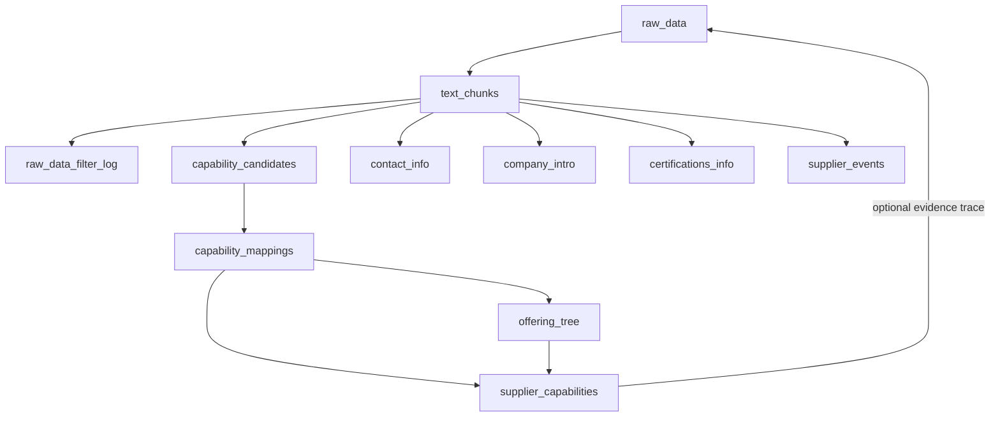
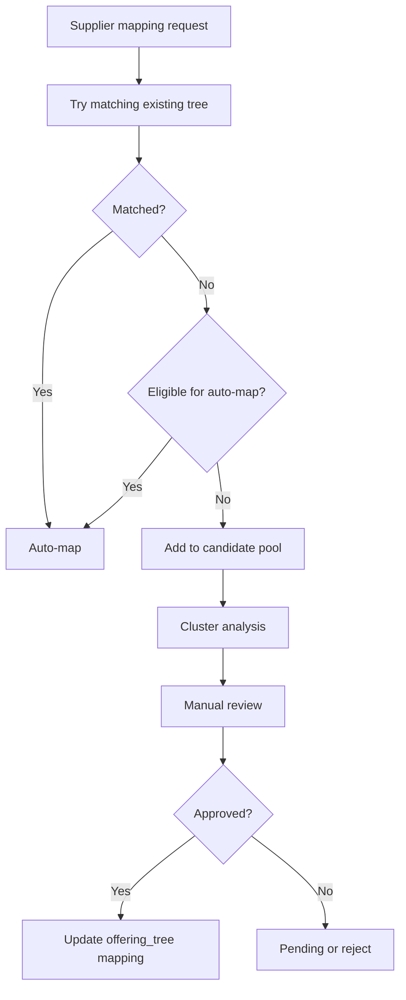

# 📄 Raw Data Processing & Capability Extraction Pipeline – Table Structure & Data Flow Design (Proposal)

------

## Principles for Capability-Structure Design

The future automated clustering and classification process will **not discard the existing** **offering_tree** **structure**, but instead build upon it.

- New candidate capability segments **must first attempt to attach to the current tree**.
- Unattachable segments may be clustered into an “out-of-structure node candidate pool” for manual review and future structure extension.
- This preserves semantic consistency, avoids fragmentation, and supports recommendation, search, and agent reasoning.

------

## 1. `raw_data`

| Field       | Type     | Description                                        |
| ----------- | -------- | -------------------------------------------------- |
| id          | PK       | Primary key                                        |
| supplier_id | FK       | Supplier ID                                        |
| source_type | varchar  | Exposure type (web, pdf, manual_upload, etc.)      |
| content     | text     | Extracted full-text content                        |
| parsed_at   | datetime | Extraction timestamp                               |
| processed   | boolean  | Whether it has been processed                      |
| batch_id    | varchar  | Batch ID for incremental processing identification |

**Data flow**:

- **Source**: crawlers, upload services, integrations, etc.
- **Destination**: Inputs into chunking and structured extraction pipelines.

------

## 2. `text_chunks`

These store raw semantic fragments. They are subject to **heuristic filtering** (e.g. labeling chunk types) but not embedding or capability matching. They feed all downstream structured extraction tasks (e.g. contact_info, certification).

| Field                  | Type     | Description                                                  |
| ---------------------- | -------- | ------------------------------------------------------------ |
| id                     | PK       | Primary key                                                  |
| raw_data_id            | FK       | Reference to `raw_data.id`                                   |
| chunk_index            | int      | Position within the original text (optional)                 |
| text                   | text     | Raw text segment                                             |
| cleaned_text           | text     | Denoised text                                                |
| chunk_type             | varchar  | e.g. general, capability_candidate, contact_info, company_intro, certifications_info, others |
| embedding_processed_at | datetime | Timestamp of embedding completion (for incremental detection) |
| is_noise               | boolean  | Whether marked as noise                                      |

**Data flow**:

- **Source**: splits of `raw_data.content`.
- **Destination**: capability mounting, clustering, search, and more.

**Design logic**:

- Filter out noise (e.g. contact info or low-value text) early.
- Separate structured segments (capabilities, contacts, intros, certifications) for specialized handling.
- Group all other text under “others” for embedding and contextual reasoning.
- New structured tables may be created if common “others” patterns emerge.
- Store `raw_data_filter_log` for audit/debug of chunk filtering.

------

## 3. `capability_candidates`

Holds segments likely indicating capabilities—filtered via rules/models.

| Field                | Type              | Description                           |
| -------------------- | ----------------- | ------------------------------------- |
| id                   | PK                | Primary key                           |
| chunk_id             | FK to text_chunks | Reference segment                     |
| filtered_by          | enum              | Rule, model, or hybrid                |
| filter_score         | float (0–1)       | Model confidence (if used)            |
| reason               | text              | Explanation for selection             |
| embedding_done       | boolean           | Whether embedding was generated yet   |
| embedding            | vector            | Embedding vector (if done)            |
| predicted_categories | jsonb             | Predicted capabilities (if available) |
| embedding_version    | text              | Embedding model version               |
| created_at           | timestamp         | Creation time                         |
| last_updated_at      | timestamp         | Last update time                      |

**Flow**:

- **Source**: from `text_chunks` via rule/model filters.
- **Purpose**: reduce embedding/classification volume.
- **Output**: candidates for modeling or manual promotion to `capability_mappings`.

------

## 4. `capability_mappings`

Records mapping of chunks to capability-tree nodes—model- or human-confirmed.

| Field            | Type                | Description                      |
| ---------------- | ------------------- | -------------------------------- |
| id               | PK                  | Primary key                      |
| chunk_id         | FK to text_chunks   | Referenced segment               |
| offering_node_id | FK to offering_tree | Target node                      |
| mapping_type     | enum                | manual, model, or hybrid         |
| mapping_score    | float               | Model confidence (if applicable) |
| is_confirmed     | boolean             | If human confirmation occurred   |
| created_at       | timestamp           | Creation time                    |
| confirmed_at     | timestamp           | Time of confirmation (if any)    |
| note             | text                | Additional annotation info       |

- Supports many-to-many relationships (a chunk may map to multiple nodes).
- Mapping confirmed by human or model.
- Integration point: credentials, search, recommendation, etc.

------

## 5. `offering_tree`

| Field           | Type          | Description                      |
| --------------- | ------------- | -------------------------------- |
| id              | PK            | Primary key                      |
| pid             | FK            | Parent node ID                   |
| name            | varchar       | Capability node name             |
| path            | text (unique) | Hierarchical path (e.g. “1.2.3”) |
| embedding       | vector        | Semantic embedding vector        |
| create_at       | timestamp     | Creation time                    |
| last_updated_at | timestamp     | Last update time                 |

Used by:

- Matching, aggregation, navigation;
- Populated from manual definitions and optimizations.

------

## 6. `supplier_capabilities` (aka supplier_offering)

Connects suppliers with capability nodes and evidence.

| Field             | Type      | Description                                       |
| ----------------- | --------- | ------------------------------------------------- |
| id                | PK        | Primary key                                       |
| supplier_id       | FK        | Supplier identifier                               |
| offering_node_id  | FK        | Capability node linked                            |
| source            | enum/text | manual, ai_extracted, or merged                   |
| evidence_text     | text      | Supporting text sample (optional)                 |
| confidence        | float     | Confidence score for AI matches (blank if manual) |
| granularity_level | varchar   | Indicates detail specificity                      |
| needs_refinement  | boolean   | Requires further refinement                       |
| created_by        | text      | Creator (user or AI)                              |
| verified          | boolean   | Human-confirmed or not                            |
| last_updated_at   | datetime  | Last updated timestamp                            |

Used in:

- Search, recommendation, agent reasoning;
- Mapped from `capability_mappings`.

------

## 7. `raw_data_filter_log`

Tracks filtering operations during chunk cleanup.

| Field         | Type     | Description                                          |
| ------------- | -------- | ---------------------------------------------------- |
| id            | PK       | Primary key                                          |
| chunk_id      | FK       | Associated `text_chunks` entry                       |
| filter_type   | varchar  | Reason category (garbage, intro, contact_info, etc.) |
| filter_reason | varchar  | Explanation of filtering action                      |
| timestamp     | datetime | When the filter was applied                          |

Used for debugging and validation.

------

## 8. General-purpose & Global Data Processing Support

Supports global tasks beyond capability extraction:

| Category                     | Description                                   | Tables                               | Notes                                     |
| ---------------------------- | --------------------------------------------- | ------------------------------------ | ----------------------------------------- |
| Garbage filtering            | Remove addresses, templates, noise            | `text_chunks`, `raw_data_filter_log` | Improves overall downstream quality       |
| Company description          | Structure corporate intros for contextual use | New table `company_profile`          | Supports multi-turn interactions          |
| Compliance data              | Track qualification & legal compliance        | New `compliance_records`             | Ensures recommendations are legally sound |
| Product/service descriptions | Manage non-capability descriptions            | `text_chunks` + potential new fields | Supports search and Q&A functionality     |
| Contact information          | Phone, email, people info                     | New `contact_info` table             | Easier maintenance and querying           |
| Time/location/event data     | Supplier timelines and events                 | New `supplier_events` table          | For event-driven queries and insights     |
| Reviews and reputation       | Customer feedback, ratings, industry rankings | `supplier_reviews` table             | Provides context for decisions            |

### Example New Tables

- `company_profile(supplier_id, company_intro_text, updated_at)`
- `compliance_records(supplier_id, compliance_type, status, issue_date)`
- `contact_info(supplier_id, contact_type, contact_value, valid_from, valid_to)`
- `supplier_events(supplier_id, event_type, event_date, description)`
- `supplier_reviews(supplier_id, review_source, rating, comments, review_date)`

------

## Architecture Diagram

------

## Incremental Processing Workflow

1. **Insert new `raw_data`** with batch_id.
2. **Split into `text_chunks`** via a scheduled job.
3. **Embed new chunks**, store vector and timestamp.
4. **Filter for capability candidates** using embeddings + heuristics.
5. **Map candidates to capability tree**, writing `capability_mappings` and updating `supplier_capabilities`.
6. **Use batch_id and processed flags/timestamps** for idempotence and incremental runs.

------

## Dynamic Expansion Mechanism

To extend structured info from “others”, include:

1. **Monitoring & Statistics Table**: `others_info_stats`, tracking keyword clusters and frequency.
2. **Auto/semi-auto Triggers**: Flag clusters meeting thresholds for structure.
3. **Table Creation & Sync**: Propose new structured tables; optionally migrate data.
4. **Iterative Optimization**: As new tables form, refine structures and field boundaries.

### Example Stats Table

| Field               | Type      | Description                           |
| ------------------- | --------- | ------------------------------------- |
| id                  | bigint    | Primary key                           |
| keyword_cluster_id  | bigint    | Cluster/category ID                   |
| keyword_set         | text[]    | Representative keyword set            |
| occurrence_count    | integer   | Frequency in “others”                 |
| last_updated        | timestamp | Last update time                      |
| structure_suggested | boolean   | Whether structured table is suggested |
| created_table_name  | text      | Created table’s name (if generated)   |

------

## Future Automatic Clustering Philosophy

- Automated clustering complements—not replaces—the `offering_tree`.
- Helps discover fine-grained nodes not currently in the tree.
- Enhances matching, reasoning, recommendations via semantic anchor continuity.
- Clustering results guide tree evolution and refinement.

------

## Additional Notes

- Use models like `text-embedding-3-small` for vector generation.
- Consider scheduling via Airflow or similar DAG-based systems.
- Maintain traceability: from `supplier_capabilities` back to `raw_data`.
- Granularity masks support explainable model decisions.
- Filter logs help auditing and quality control.

------

## Appendix A: Supplier-to-Product Node Mapping & Semantic Extension

Many suppliers tie to broader product categories rather than leaf nodes. To formalize this:

- Add `coverage_type` to supplier-offering relationship:
  - **leaf**: default—supplier covers just the exact node.
  - **group**: indicates supplier covers that node **and all sub-nodes**.

Benefits:

- Clarifies historical intent without changing schema.
- Enables agents to infer group-level coverage.
- Compatible with legacy data (default to leaf).
- Avoids bloating supplier tables with type logic.

**Example**: If a supplier maps to “Power Assembly” node with `coverage_type=group`, it implicitly covers all subcategories like batteries and converters. Queries for “battery” should retrieve this supplier accordingly.

------

## Appendix B: Handling Out-of-Structure Node Requests & Manual Review Workflow

### 1. Background

Suppliers may request mapping to non-existent structure nodes. Ignoring or auto-mapping these is risky. Hence, we introduce a candidate pool + clustering + manual review approach.

### 2. Candidate Pool

- Unmatched mappings go to a candidate pool.
- Similar requests are semantically clustered.
- Clusters feed suggestions for tree extension, subject to human approval.

### 3. Manual Review Logic

Not all candidates require review:

- Auto-map if certain rules/trust thresholds are met.
- Else, push to candidate pool.

Rule examples:

- Semantic similarity below threshold.
- Low supplier credibility.
- Novel or missing capability domains.

### 4. Workflow

Steps:

1. Submit request → Try simple match.
2. If failed, check auto-map eligibility.
3. If auto-eligible → map; if not → pool + clustering.
4. Manual review → decide mapping or reject.

------

## Appendix C: Future Iteration

- **Active learning**: Use manual confirmations to re-train models.
- Implement a **weighted confidence and granularity system** to inform models and agents better.

------

